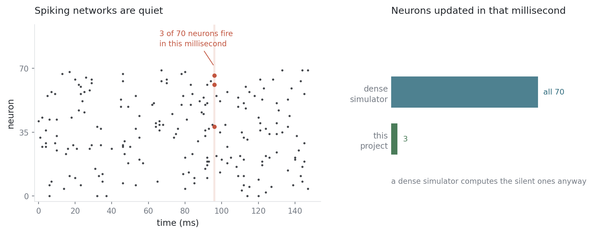
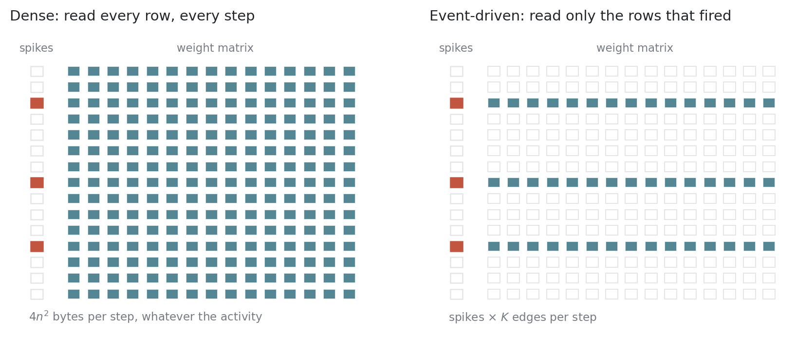
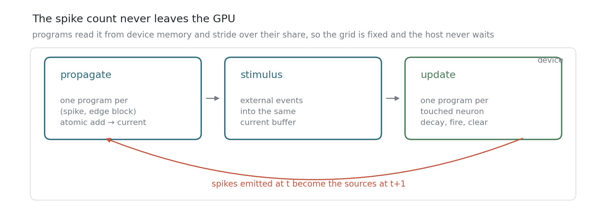
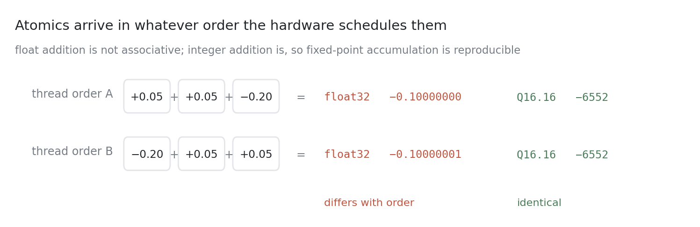
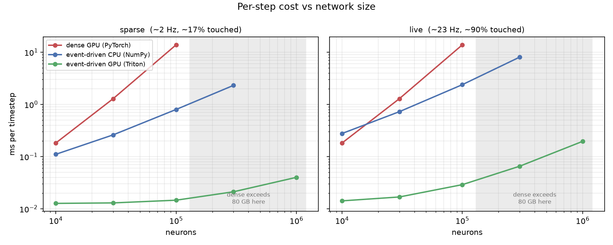
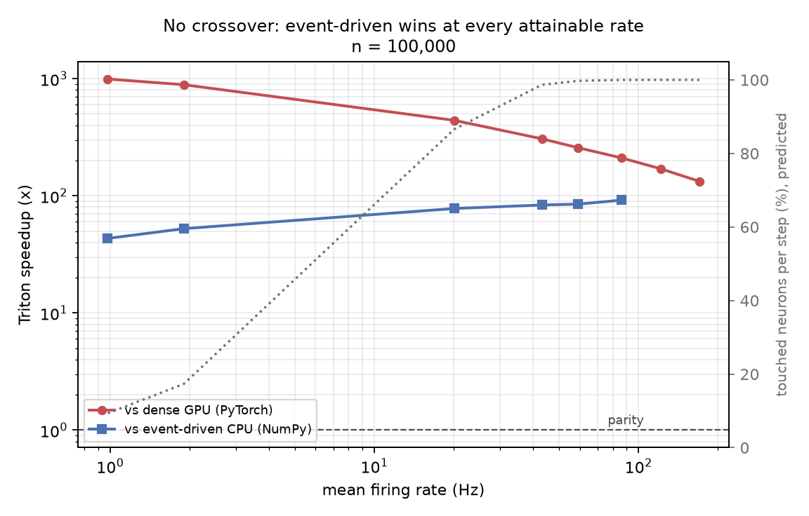
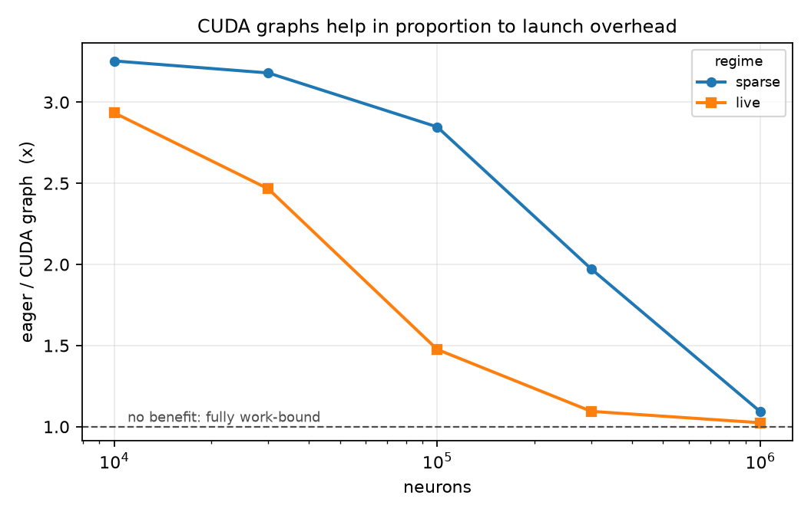

# event-driven-snn

Event-driven sparse spiking-network simulation: propagate only from the neurons
that fired, and build the active set on the GPU itself.

---

## What this is, in one section

A **spiking neural network** is a model of biological neurons. Each neuron holds
a charge that leaks away over time, gains charge when other neurons send it a
pulse, and fires a pulse of its own when the charge crosses a threshold. That
pulse is a *spike*. Simulating one means stepping time forward in small
increments and, at each step, working out who fired and where their spikes went.

The useful fact is that almost nobody fires. At biologically realistic rates a
neuron spikes a few times a second, so in any given millisecond upwards of 98%
of the network is silent.



A **dense** simulator ignores this. It represents connectivity as a big matrix
and advances the network by multiplying the whole thing by the spike vector,
which computes every neuron's input whether or not anything was sent to it. It
is simple, it maps beautifully onto a GPU, and at a million neurons it reads
tens of gigabytes per millisecond to move the signal from a few hundred rows.

A **sparse** or **event-driven** simulator does only the work the spikes create:
iterate over the neurons that fired, follow their outgoing connections, and
update only the neurons on the receiving end. Far less arithmetic — but the work
is irregular, scattered through memory, and its shape isn't known in advance,
which is exactly what GPUs are bad at.

This repository is a GPU kernel that does the second thing anyway, written in
[Triton](https://triton-lang.org). At a million neurons it advances the network
in 0.2 ms per timestep. Output is exact: spike trains are bit-identical to a CPU
reference, not an approximation.

**New to this?** [Neuronal Dynamics](https://neuronaldynamics.epfl.ch/), ch. 1,
is the clearest short treatment of the neuron model, and
[Eshraghian et al.](https://arxiv.org/abs/2109.12894) is a readable modern
tutorial. More at the bottom.

---

## The idea

A dense timestep multiplies the spike vector by the full weight matrix. Rows
belonging to silent neurons get multiplied by zero and thrown away, but they are
still read from memory, and reading them is what the step costs.



Skipping them means iterating over the neurons that fired and scattering their
weights into their targets: `spikes × K` edges instead of `n²`.

The catch is that the set of firing neurons isn't known until the previous
timestep has finished computing it. It's produced by the simulation, it changes
every step, and it lives in GPU memory. There is nothing to pre-sort and nothing
to schedule ahead of time — the kernel has to discover its own work as it runs.

## How the kernel finds its work

Each timestep is a breadth-first frontier expansion. Spikes are the frontier,
synapses are the edges, and traversing them produces the next frontier.



Two things keep the host out of it.

**The active set is built by atomic test-and-set.** When a program scatters a
weight into neuron `j`, it atomically swaps a per-neuron flag to 1. Exactly one
program sees the old value 0, and that one appends `j` to a queue. No
duplicates, no sorting, and no scan across all `n` neurons to discover who
received input.

**Nobody asks how many neurons fired.** Triton needs the grid size on the host,
but the spike count only exists on the device. Copying it back each step costs a
synchronisation per timestep, which at these speeds is the whole budget. Instead
a fixed number of programs launch, and each reads the count from device memory
and strides over its share. The grid never changes and the CPU never waits —
which is also what makes the entire multi-step loop capturable as a single CUDA
graph later.

## Why the results are exact

The scatter uses atomic adds, and atomics land in whatever order the hardware
happens to schedule them. Floating-point addition isn't associative, so the same
kernel run twice would disagree in the last bits.



That matters more than it sounds. Spiking networks are chaotic: a one-ulp
difference in membrane potential drifts silently for tens of steps, then flips a
threshold crossing, after which the two runs have nothing in common. Measured
here, perturbing the weights by 3×10⁻⁶ changes the first spike at step 67 and
shifts 10% of total activity by step 300.

Accumulating synaptic current in Q16.16 fixed-point integers removes the problem.
Integer addition *is* associative, so thread order cannot affect the total. That
is what lets the correctness gate demand exact equality instead of a tolerance,
and why the kernel reproduces both itself and the CPU reference bit-for-bit.

## Results

H100 80GB SXM, fan-out 100, fp32. Two activity levels: a **sparse** regime at
1.9 Hz where ~17% of neurons receive input per step, and a **live** regime at
22 Hz where ~90% do and 90% of spikes are caused by other neurons rather than by
external input.



At 100k neurons a timestep takes 15 µs against the dense baseline's 13.8 ms. A
million-neuron recurrent network at 22 Hz runs at 0.196 ms per timestep, roughly
5,000 simulated steps per second.

The dense line stops at 100k because the weight matrix is `4n²` bytes — 40 GB at
n=10⁵, 68 GB at 1.3×10⁵, and past that nothing dense fits on the card at any
speed.

Worth stating plainly: **the dense baseline is not a strawman.** It sustains
2,950–3,050 GB/s, or 88–91% of this card's peak bandwidth. cuBLAS is running
about as fast as a dense matvec can. The algorithm is what differs, not the
implementation — which is also why single-threaded NumPy running the
event-driven algorithm beats an H100 running the dense one by 23× at 1.3×10⁵
neurons.

### There is no crossover



The active-set trick should stop paying off as firing rates rise. At rate `f` the
expected fraction of neurons receiving input is `1 − exp(−f·K)`, which saturates
by around 40 Hz; past that, skipping inactive neurons saves nothing.

The speedup survives anyway — 133× to 992× across a 170× range in firing rate,
and still 133× when every neuron is touched every step. The saturating term was
never where the win came from. Dense costs `n²` per step and the scatter costs
`f·n·K`; those are equal at `f = n/K`, which exceeds 1 for any `n > K` and is
therefore unreachable. The scatter advantage doesn't saturate because it can't.

### The kernel is latency-bound until it isn't



At 10k neurons the real work in a timestep is a couple of microseconds against
three kernel launches at ~5 µs each. An empty-loop measurement put launch
overhead at 46–58% of runtime, so capturing the whole per-step sequence as one
replayable CUDA graph was worth more than any change to the kernels themselves.

It buys 3.3× at n=10⁴ and 1.02× at n=10⁶. The decline is the useful part: graphs
remove launch overhead and nothing else, so the speedup they give is a direct
measurement of how much of the runtime was launch-bound. By a million neurons
there is enough work to hide it.

## Notes

- **Activity is externally driven.** Firing is set by a sparse stimulus rather
  than sustained by the network at the low rates, and that isn't incidental: at
  fan-out 100 there is no regime that is both self-sustaining and sparse. Below
  ~4 Hz of drive the network contributes nothing; above ~5 Hz it crosses a
  first-order transition into self-amplification, and by then ~90% of neurons
  are touched per step. Recurrent dynamics or a sparse active set, not both. The
  live-regime numbers are past that transition.
- **The stimulus is sparse on purpose.** Standard benchmark networks drive every
  neuron with independent Poisson input at every step. Under that drive every
  neuron is active every step and the event-driven formulation degenerates into
  the dense one. The sparsity of the external input is load-bearing for
  everything above, so `kick_frac` is reported with every number.
- **Verified small, trusted large.** The exact chain only exists where the CPU
  reference can run, up to 3×10⁵ neurons. The million-neuron numbers have no
  independent reference, because nothing else runs there.
- **Ratios are softer than the GPU numbers.** GPU timings reproduce to ~1%
  between runs; the CPU baseline drifted 16% on a shared node. `results/*.csv`
  carries each row's hardware and thread count so ratios can be read with their
  spread.
- The model is deliberately minimal: LIF only, fixed weights, uniform one-step
  delay, instantaneous current. No plasticity, no per-synapse delays, no claims
  of biological plausibility. This is a systems project on a neuroscience
  substrate.

## Correctness

```bash
python -m pytest tests/ -q          # 44 tests
python scripts/check_triton.py      # Triton vs CPU reference, bit-exact
python scripts/check_graph.py       # graph replay vs eager, bit-exact
```

| Comparison | Guarantee |
|---|---|
| any implementation, run twice | bit-exact |
| naive dense (fixed-point) ↔ event-driven CPU | bit-exact |
| event-driven CPU ↔ event-driven Triton | bit-exact |
| float32 dense implementations | exact for 25 steps, then rates and per-neuron counts |

Checked across four neuron-model variants — default, non-zero reset, longer
refractory, no refractory — and re-checked at every point in both sweeps.

The suite includes meta-tests asserting the fixture can actually fail: that most
spikes are network-driven rather than externally injected, and that the
lazy-decay path runs with `elapsed > 1`. Without them, a network where every
spike is a stimulus kick would pass the entire equivalence suite while testing
nothing about propagation.

One bug worth recording, since it is the class of thing this machinery exists to
catch. Triton contracts `v*decay + current` into a fused multiply-add with one
rounding; NumPy does the multiply and the add separately, with two. One ulp
apart. The membrane potentials diverged at step 3 and the spike trains at step
49, and the exact chain broke only at 3×10⁵ neurons in the live regime, where
enough threshold crossings exist for one to land in the gap. Bisecting on spikes
finds step 49 and tells you nothing; bisecting on the continuous state finds step
3 and 4,532 differing neurons, which says immediately that it is arithmetic and
not bookkeeping.

## Further reading

**Spiking neurons, from scratch**
- [Neuronal Dynamics](https://neuronaldynamics.epfl.ch/) — Gerstner, Kistler,
  Naud & Paninski. Free online; chapter 1 covers the leaky integrate-and-fire
  model used here and is the only neuroscience needed to follow this repo.
- [Training Spiking Neural Networks Using Lessons From Deep Learning](https://arxiv.org/abs/2109.12894)
  — Eshraghian et al., *Proc. IEEE* 2023. A readable modern tutorial, with
  companion notebooks in [snnTorch](https://snntorch.readthedocs.io).

**How simulators are built**
- Brette et al. (2007), *Simulation of networks of spiking neurons: a review of
  tools and strategies*, J. Comput. Neurosci. 23. The clock-driven versus
  event-driven distinction, which is the frame for this whole project.
- Rotter & Diesmann (1999), *Exact digital simulation of time-invariant linear
  systems*, Biol. Cybern. 81. Why reconstructing a neuron's state on demand is
  exact rather than approximate for this class of model.
- Brunel (2000), *Dynamics of sparsely connected networks of excitatory and
  inhibitory spiking neurons*, J. Comput. Neurosci. 8. Where the firing-rate
  regimes come from, and why low-rate irregular activity is hard to sustain.

**Sparse and irregular work on GPUs**
- Merrill, Garland & Grimshaw (2012), *Scalable GPU graph traversal*, PPoPP.
  Frontier expansion, work compaction and load balancing — the direct ancestor
  of the propagate kernel here.
- Bell & Garland (2009), *Implementing sparse matrix-vector multiplication on
  throughput-oriented processors*, SC. Why sparse formats behave the way they do
  on this hardware.
- [Triton tutorials](https://triton-lang.org/main/getting-started/tutorials/index.html)
  — enough to read the kernels in this repo.

**Related**
- Knight & Nowotny (2018), *GPUs outperform current HPC and neuromorphic
  solutions...*, Front. Neurosci. 12, and [GeNN](https://github.com/genn-team/genn),
  the established GPU spiking simulator. Useful for calibrating what a mature
  implementation achieves.

## Layout

```
src/snnkern/
  spec.py                    parameters, decay table
  fixedpoint.py              Q16.16 conversion and overflow guard
  network.py                 CSR-by-source connectivity, frozen to disk
  stimulus.py                sparse external event stream, frozen
  record.py                  ragged spike trains, hashing, rate/CV
  check.py                   correctness gate, first-divergence report
  timing.py                  CUDA-event timing, median + IQR
  results.py                 CSV output with hardware provenance
  data.py                    load-or-build frozen networks
  impls/
    naive_dense.py           Python loops, float or fixed-point; the pivot
    vectorized_dense.py      NumPy BLAS matvec
    event_sparse_cpu.py      scatter + active set + lazy decay
    dense_gpu.py             PyTorch fp32 dense matvec baseline
    event_sparse_triton.py   the kernel, with optional graph capture
scripts/                     data generation, checks, profiling, sweeps, plots
tests/                       44 tests: equivalence, determinism, fixture sanity
readme_assets/               diagrams and shared figure style
results/                     benchmark CSVs and figures
```

## Running

```bash
pip install -e ".[dev]"
pip install torch --index-url https://download.pytorch.org/whl/cu126

export SNNKERN_DATA=/path/to/scratch/data     # networks reach 1.2 GB
export OMP_NUM_THREADS=$SLURM_CPUS_PER_TASK

python scripts/make_data.py       # freeze networks and stimuli
python -m pytest tests/ -q
python scripts/sweep_size.py
python scripts/sweep_activity.py
python scripts/plots.py
```

Networks and stimuli are generated once from fixed seeds and frozen to `.npz`,
named by a tag covering every parameter that affects generation. The GPU and CPU
implementations have to be provably reading the same input, and "same seed" is
weaker than "same bytes" — NumPy's bounded-integer generator consumes its stream
differently depending on how generation is chunked.

Timings use CUDA events with warm-up and repeats, report median and IQR, and
exclude setup. Figures are generated from the CSVs only, so no figure can show a
number that isn't in a committed file.
